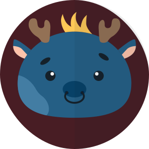

<div align="center">
  
</div>

# Server Animal Avatar Generator

Generate SVG [animal avatars](https://github.com/roma-lukashik/animal-avatar-generator) on server side with query params.
If options are missing it takes a random option.

## Development

Using npm:
```bash
$ npm install
$ npm run serve
```

## Query options

|Name|Description|Options|
|---|---|---|
|`size`|Avatar size in pixels|integer|
|`round`|Use round or rectangle shape|`true` or `false`|
|`blackout`|Use blackout for right side of an avatar|`true` or `false`|
|`avatarColor`|Avatar color|Hex color changing the `#` for `%23`|
|`hairColor`|Avatar hair color|Hex color changing the `#` for `%23`|
|`backgroundColor`|Background color|Hex color changing the `#` for `%23`|
|`pattern`|Avatar pattern|`jawPattern`, `rightEyePattern`, `leftEyePattern`|
|`ears`|Avatar ears|`prickEars`, `buttonEars`, `roseEars`, `cowEars`, `heartShapeEars`, `bearEars`, `reindeerEars`, `foldedEars`, `ellipseEars`, `batEars`, `deerEars`, `giraffeEars`, `goatEars`, `mouseEars`|
|`hair`|Avatar hair|`curlyHair`, `fringeHair`, `palmTreeHair`, `crestHair`|
|`muzzle`|Avatar muzzle|`tongueMuzzle`, `whiteNeutralMuzzle`, `bullMuzzle`, `smallTongueMuzzle`, `smallSmileyMuzzle`, `smileyWhiteMuzzle`, `worriedMuzzle`, `boarMuzzle`, `hippoMuzzle`, `sideSmileyMuzzle`, `catMuzzle`, `neutralMuzzle`, `sealMuzzle`, `smileyMuzzle`, `horseMuzzle`, `monkeyMuzzle`|
|`eyes`|Avatar eyes|`brightEyes`, `downEyes`, `upEyes`, `brighterEyes`, `twoSideEyes`, `triangleEyes`, `leftEyes`, `distantLeftEyes`|
|`brows`|Avatar brows|`ellipseBrows`, `rectBrows`, `arcBrows`|

For example the image above was obtained with

```
https://animal-avatar.up.railway.app/?size=300&round=true&blackout=true&avatarColor=%23255f85&hairColor=%23ffc857&backgroundColor=%23481d24&pattern=jawPattern&ears=reindeerEars&hair=crestHair&muzzle=bullMuzzle&eyes=upEyes&brows=ellipseBrows
```
